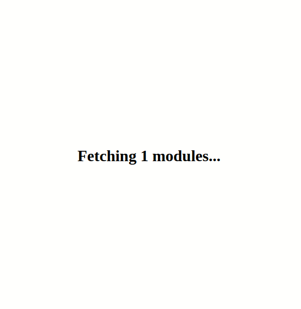

# A todo app without a bundler!

How is this possible, you ask? With [JavaScript modules](https://developer.mozilla.org/en-US/docs/Web/JavaScript/Guide/Modules), the browser can dynamically fetch relative (`./myfile.js`) or bare (`react`) JS imports (with an import map)! This prototype shows how JS module syntax and support is getting better all the time, requiring less and less complexity from your build infrastructure.

### However

A bundler is definitely better. Because the browser can only fetch each module when they are explicitly imported, this results in a cascade of imports that are more sequential than parallel. As well as that, there's no tree-shaking, so a ton of JS is downloaded that won't be used! So we're not quite there yet.

